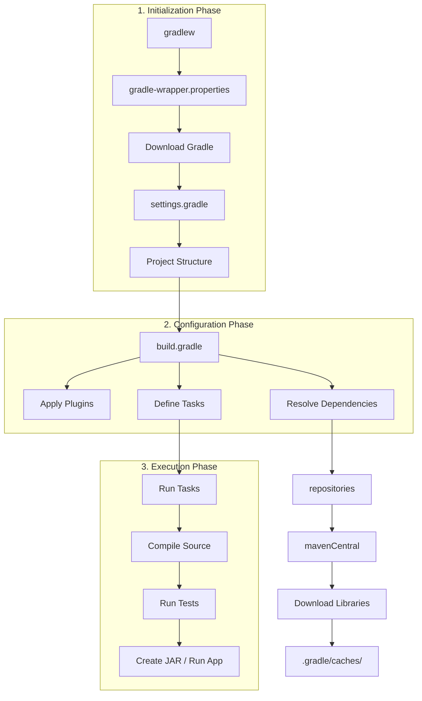
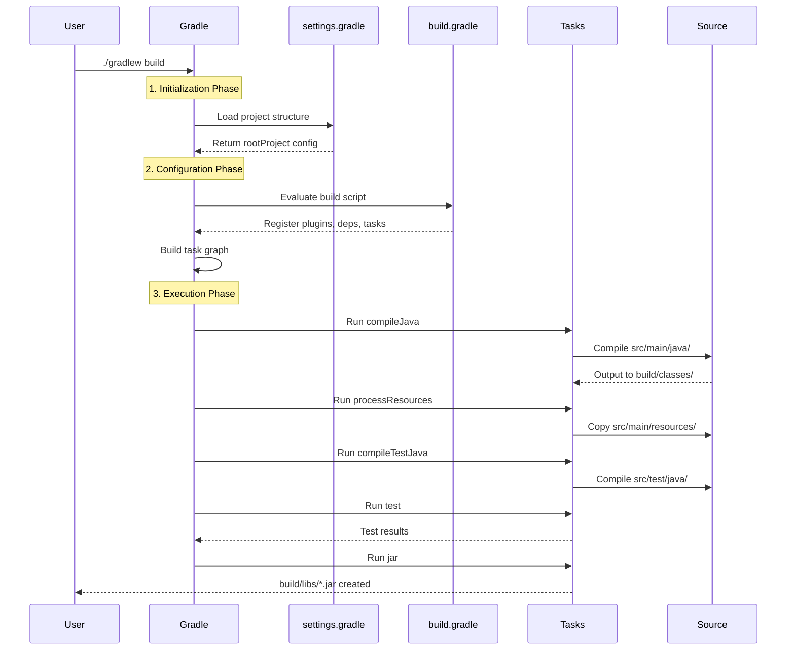
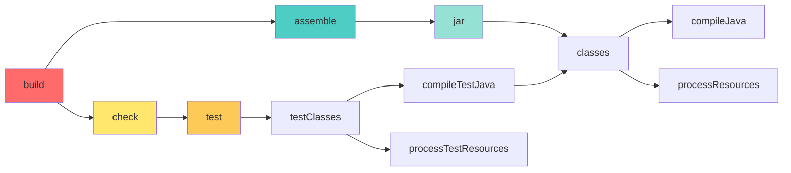

# Gradle プロジェクト構成ガイド

## 📋 目次

- [プロジェクト構造](#プロジェクト構造)
- [設定ファイルの説明](#設定ファイルの説明)
- [ファイル間の関係性](#ファイル間の関係性)
- [Gradle コマンド一覧](#gradleコマンド一覧)
- [ビルドライフサイクル](#ビルドライフサイクル)
- [依存関係の管理](#依存関係の管理)

---

## 📁 プロジェクト構造

```
java_docker_fcc/
├── src/
│   ├── main/
│   │   ├── java/                    # Javaソースコード
│   │   │   └── com/example/app/
│   │   │       └── Main.java
│   │   └── resources/               # 設定ファイル、プロパティなど
│   └── test/
│       ├── java/                    # テストコード
│       │   └── com/example/app/
│       └── resources/               # テスト用リソース
│
├── build/                           # ビルド成果物（自動生成）
│   ├── classes/                     # コンパイル済み.classファイル
│   ├── libs/                        # 生成されたJARファイル
│   └── reports/                     # テストレポートなど
│
├── gradle/                          # Gradle Wrapper関連
│   └── wrapper/
│       ├── gradle-wrapper.jar
│       └── gradle-wrapper.properties
│
├── .gradle/                         # Gradleキャッシュ（自動生成）
│
├── build.gradle                     # ビルド設定ファイル ⭐
├── settings.gradle                  # プロジェクト設定ファイル ⭐
├── gradlew                          # Gradle Wrapper (Unix/Mac)
├── gradlew.bat                      # Gradle Wrapper (Windows)
└── .gitignore
```

---

## 📝 設定ファイルの説明

### 1. `settings.gradle` - プロジェクトルート設定

**役割**: プロジェクト全体の基本設定を定義

```groovy
rootProject.name = 'java-docker-study'

// マルチプロジェクトの場合
// include 'subproject1', 'subproject2'
```

| 項目               | 説明                                             |
| ------------------ | ------------------------------------------------ |
| `rootProject.name` | プロジェクト名（JAR ファイル名などに使用）       |
| `include`          | サブプロジェクトを含める（マルチモジュール構成） |

**実行タイミング**: Gradle 起動時に最初に読み込まれる

---

### 2. `build.gradle` - ビルドスクリプト

**役割**: ビルド方法、依存関係、タスクを定義

#### 2.1 プラグイン設定

```groovy
plugins {
    id 'java'           // Javaプロジェクトの基本機能
    id 'application'    // 実行可能アプリケーション機能
}
```

| プラグイン    | 提供される機能                |
| ------------- | ----------------------------- |
| `java`        | compile, test, jar タスク     |
| `application` | run タスク、実行可能 JAR 作成 |

#### 2.2 プロジェクトメタデータ

```groovy
group = 'com.example'           // パッケージのグループID
version = '1.0-SNAPSHOT'        // バージョン番号
```

#### 2.3 Java バージョン設定

```groovy
java {
    sourceCompatibility = JavaVersion.VERSION_21  // ソースコードのJavaバージョン
    targetCompatibility = JavaVersion.VERSION_21  // コンパイル後の実行環境バージョン
}
```

| 設定                  | 説明                               |
| --------------------- | ---------------------------------- |
| `sourceCompatibility` | コードで使える言語機能のバージョン |
| `targetCompatibility` | 生成される.class ファイルの互換性  |

#### 2.4 アプリケーション設定

```groovy
application {
    mainClass = 'com.example.app.Main'  // エントリーポイント（main メソッドがあるクラス）
}
```

#### 2.5 リポジトリ設定

```groovy
repositories {
    mavenCentral()      // Maven Central Repository から依存関係をダウンロード
    // google()         // Google の Maven リポジトリ
    // mavenLocal()     // ローカルの .m2 ディレクトリ
}
```

#### 2.6 依存関係の定義

```groovy
dependencies {
    // コンパイル時と実行時に必要
    implementation 'com.google.guava:guava:31.1-jre'

    // テスト時のみ必要
    testImplementation 'org.junit.jupiter:junit-jupiter:5.9.3'
    testRuntimeOnly 'org.junit.platform:junit-platform-launcher'

    // コンパイル時のみ必要（実行時は不要）
    compileOnly 'org.projectlombok:lombok:1.18.26'

    // 実行時のみ必要
    runtimeOnly 'com.h2database:h2:2.1.214'
}
```

**依存関係スコープの違い**:

| スコープ             | コンパイル時 | 実行時 | テスト      | 推移的依存 |
| -------------------- | ------------ | ------ | ----------- | ---------- |
| `implementation`     | ✓            | ✓      | -           | 隠蔽       |
| `compileOnly`        | ✓            | ✗      | -           | -          |
| `runtimeOnly`        | ✗            | ✓      | -           | -          |
| `testImplementation` | -            | -      | ✓           | -          |
| `testRuntimeOnly`    | -            | -      | ✓(実行のみ) | -          |

#### 2.7 カスタムタスク

```groovy
// ホットリロード用タスク
task watch(type: JavaExec) {
    group = 'application'
    description = 'Run the application with auto-reload'
    classpath = sourceSets.main.runtimeClasspath
    mainClass = application.mainClass
    standardInput = System.in
}

// 依存関係表示タスク
task showDependencies {
    group = 'help'
    description = 'Show project dependencies tree'
    doLast {
        println "=== Dependencies ==="
        configurations.runtimeClasspath.each { println it.name }
    }
}

// クリーンビルドタスク
task cleanBuild {
    group = 'build'
    description = 'Clean and build the project'
    dependsOn clean, build
}
```

---

### 3. `gradle/wrapper/gradle-wrapper.properties`

**役割**: Gradle Wrapper のバージョン指定

```properties
distributionBase=GRADLE_USER_HOME
distributionPath=wrapper/dists
distributionUrl=https\://services.gradle.org/distributions/gradle-8.11.1-bin.zip
zipStoreBase=GRADLE_USER_HOME
zipStorePath=wrapper/dists
```

**メリット**: チーム全員が同じ Gradle バージョンを使用できる

---

## 🔗 ファイル間の関係性



---

## 🔧 Gradle コマンド一覧

### 基本コマンド

```bash
# Gradle Wrapper を使用（推奨）
./gradlew <task>

# システムのGradleを使用
gradle <task>
```

### ビルド関連

| コマンド             | 説明                 | 実行内容                         |
| -------------------- | -------------------- | -------------------------------- |
| `gradle build`       | プロジェクトをビルド | compile → test → jar             |
| `gradle clean`       | ビルド成果物を削除   | build/ ディレクトリを削除        |
| `gradle clean build` | クリーン後ビルド     | 前回のビルドをクリアして再ビルド |
| `gradle assemble`    | テストなしでビルド   | compile → jar（テストスキップ）  |

### 実行関連

| コマンド                  | 説明                   | 備考                                 |
| ------------------------- | ---------------------- | ------------------------------------ |
| `gradle run`              | アプリケーションを実行 | mainClass を実行                     |
| `gradle run --continuous` | ホットリロードで実行   | ファイル変更を監視して自動再実行     |
| `gradle watch`            | カスタムタスクで実行   | build.gradle で定義した watch タスク |

### コンパイル関連

| コマンド                 | 説明                     | 出力先                         |
| ------------------------ | ------------------------ | ------------------------------ |
| `gradle compileJava`     | メインコードをコンパイル | build/classes/java/main/       |
| `gradle compileTestJava` | テストコードをコンパイル | build/classes/java/test/       |
| `gradle classes`         | 全てのクラスをコンパイル | compileJava + processResources |

### テスト関連

| コマンド                                  | 説明                       | レポート                            |
| ----------------------------------------- | -------------------------- | ----------------------------------- |
| `gradle test`                             | テストを実行               | build/reports/tests/test/index.html |
| `gradle test --tests "com.example.app.*"` | 特定のテストのみ実行       | パターンマッチで指定                |
| `gradle test --rerun-tasks`               | キャッシュを無視して再実行 | 強制的に全テスト実行                |

### 依存関係関連

| コマンド                                               | 説明                         |
| ------------------------------------------------------ | ---------------------------- |
| `gradle dependencies`                                  | 依存関係ツリーを表示         |
| `gradle dependencies --configuration runtimeClasspath` | 実行時の依存関係のみ表示     |
| `gradle dependencyInsight --dependency <name>`         | 特定の依存関係を詳細表示     |
| `gradle showDependencies`                              | カスタムタスクで依存関係表示 |

### JAR 作成関連

| コマンド         | 説明                               | 出力先            |
| ---------------- | ---------------------------------- | ----------------- |
| `gradle jar`     | JAR ファイルを作成                 | build/libs/\*.jar |
| `gradle bootJar` | 実行可能 JAR を作成（Spring Boot） | 全依存関係を含む  |

### 情報表示

| コマンド                    | 説明                         |
| --------------------------- | ---------------------------- |
| `gradle tasks`              | 実行可能なタスク一覧         |
| `gradle tasks --all`        | 全タスク（内部タスク含む）   |
| `gradle projects`           | プロジェクト構造を表示       |
| `gradle properties`         | プロジェクトプロパティを表示 |
| `gradle help --task <task>` | 特定タスクのヘルプ           |

### デバッグ・トラブルシューティング

| コマンド                              | 説明                                   |
| ------------------------------------- | -------------------------------------- |
| `gradle build --info`                 | 詳細ログを表示                         |
| `gradle build --debug`                | デバッグログを表示                     |
| `gradle build --stacktrace`           | スタックトレースを表示                 |
| `gradle build --scan`                 | ビルドスキャンを生成（オンライン分析） |
| `gradle build --refresh-dependencies` | 依存関係を強制再ダウンロード           |

### Gradle Wrapper 関連

| コマンド                                  | 説明                            |
| ----------------------------------------- | ------------------------------- |
| `gradle wrapper`                          | Wrapper ファイルを生成          |
| `gradle wrapper --gradle-version 8.11.1`  | 特定バージョンの Wrapper を生成 |
| `./gradlew --version`                     | Gradle バージョン確認           |

---

## ⚙️ ビルドライフサイクル

Gradle は 3 つのフェーズで実行されます:



### タスク依存関係



**実行例**:

```bash
gradle build
# ↓ 実際に実行されるタスク
# :compileJava
# :processResources
# :classes
# :jar
# :assemble
# :compileTestJava
# :processTestResources
# :testClasses
# :test
# :check
# :build
```

---

## 📦 依存関係の管理

### 依存関係の記述方法

```groovy
dependencies {
    // 形式: 'group:name:version'
    implementation 'com.google.guava:guava:31.1-jre'

    // 変数を使用
    def springVersion = '5.3.23'
    implementation "org.springframework:spring-core:${springVersion}"

    // 動的バージョン（非推奨）
    implementation 'com.example:library:1.+'  // 1.x の最新
    implementation 'com.example:library:+'    // 最新版

    // バージョン範囲
    implementation 'com.example:library:[1.0,2.0)'  // 1.0 <= version < 2.0

    // ローカルJARファイル
    implementation files('libs/local-library.jar')
    implementation fileTree(dir: 'libs', include: ['*.jar'])
}
```

### 依存関係の除外

```groovy
dependencies {
    implementation('com.example:library:1.0') {
        // 特定の推移的依存関係を除外
        exclude group: 'org.unwanted', module: 'dependency'
    }

    // すべての推移的依存関係を除外
    implementation('com.example:library:1.0') {
        transitive = false
    }
}
```

### 依存関係の解決戦略

```groovy
configurations.all {
    resolutionStrategy {
        // バージョンを強制
        force 'com.google.guava:guava:31.1-jre'

        // キャッシュの有効期限
        cacheDynamicVersionsFor 10, 'minutes'
        cacheChangingModulesFor 4, 'hours'

        // 競合解決
        failOnVersionConflict()  // バージョン競合でビルド失敗
    }
}
```

---

## 🎯 実践例

### 例 1: 新しいライブラリの追加

```bash
# 1. build.gradle に依存関係を追加
# dependencies {
#     implementation 'com.fasterxml.jackson.core:jackson-databind:2.15.2'
# }

# 2. 依存関係をダウンロード
gradle build --refresh-dependencies

# 3. 依存関係の確認
gradle dependencies
```

### 例 2: マルチプロジェクト構成

**settings.gradle**:

```groovy
rootProject.name = 'my-app'
include 'common', 'api', 'web'
```

**api/build.gradle**:

```groovy
dependencies {
    implementation project(':common')  // 他のサブプロジェクトに依存
}
```

### 例 3: プロファイル別設定

**build.gradle**:

```groovy
ext {
    profile = project.hasProperty('profile') ? project.property('profile') : 'dev'
}

if (profile == 'prod') {
    // 本番用設定
} else {
    // 開発用設定
}
```

**実行**:

```bash
gradle build -Pprofile=prod
```

---

## 🔍 トラブルシューティング

### 問題 1: 依存関係が解決できない

```bash
# キャッシュをクリア
rm -rf ~/.gradle/caches/

# 依存関係を再ダウンロード
gradle build --refresh-dependencies
```

### 問題 2: ビルドが遅い

```bash
# ビルドスキャンで原因を特定
gradle build --scan

# 並列ビルドを有効化（gradle.properties）
org.gradle.parallel=true
org.gradle.caching=true
```

### 問題 3: バージョン競合

```bash
# 依存関係ツリーで競合を確認
gradle dependencies --configuration runtimeClasspath

# 特定のライブラリの依存経路を調査
gradle dependencyInsight --dependency guava --configuration runtimeClasspath
```

---

## 📚 参考リンク

- [Gradle 公式ドキュメント](https://docs.gradle.org/)
- [Gradle User Manual](https://docs.gradle.org/current/userguide/userguide.html)
- [Gradle Plugins Portal](https://plugins.gradle.org/)
- [Maven Central Repository](https://search.maven.org/)

---

## ⚡ クイックリファレンス

```bash
# よく使うコマンド
gradle build              # ビルド
gradle clean build        # クリーンビルド
gradle run                # 実行
gradle test               # テスト
gradle dependencies       # 依存関係表示
gradle tasks              # タスク一覧

# ホットリロード
gradle run --continuous

# トラブルシューティング
gradle build --info --stacktrace
gradle build --refresh-dependencies
```
